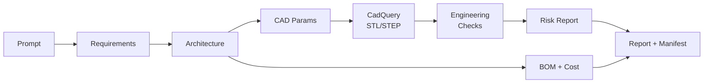

# Agentic Mechanical Engineer

**Type one sentence. Get an engineering package.**

An AI mechanical engineering agent that turns a natural-language product
request into a structured, honest, concept-level engineering package:
requirements, system architecture, parametric CAD (STL + STEP), engineering
checks, a risk report, a costed BOM, and a written engineering report.

```
"Design a mobile robot that can inspect manufacturing equipment for 8 hours."
                                   │
                                   ▼
   outputs/
   ├── requirements.json        structured reqs + explicit assumptions
   ├── architecture.json        drivetrain, battery sizing, motors, materials
   ├── cad_params.json          bound-checked parametric dimensions
   ├── robot_chassis.stl        real CadQuery geometry (+ .step)
   ├── simulation_results.json  6 engineering checks, formulas included
   ├── risk_report.json         rule-based risks with severities
   ├── bom.csv                  13 parts, ~$774, under budget
   ├── engineering_report.md    the whole story, for humans
   └── artifact_manifest.json   index of everything above
```

## Quickstart (Docker — recommended)

```bash
git clone https://github.com/jose2505207-eng/agentic-mechanical-engineer
cd agentic-mechanical-engineer
docker compose up --build
```

Dashboard: **http://localhost:3000** · API docs: http://localhost:8000/docs.
Runs fully offline in deterministic mode with no configuration. To enable
the AI designer (generative CAD, LLM requirements/architecture), copy
`.env.example` to `.env` and set an LLM provider (see [`env-space`](env-space)) —
compose picks it up automatically.

## Quickstart (local dev)

```bash
make install    # venv + deps (CadQuery is a big download)
make demo       # the line above, for real, in under a second
make test       # 66 tests validating the golden path
make api        # FastAPI at http://localhost:8000/docs
```

No API keys, no database, no GPU required. The core pipeline is fully offline.

### Web UI

```bash
make install-frontend   # once (Node 18+)
make api                # terminal 1 — backend on :8000
make frontend           # terminal 2 — UI on http://localhost:3000
```

Prompt box → Run design → live status, artifact list, rendered engineering
report, and an orbitable 3D view of the generated chassis.

## Architecture



The pipeline is a **deterministic spine with AI-upgradeable vertebrae**:
every stage is a typed function behind a Pydantic contract
(`backend/app/schemas/`). LLM-backed stages (`backend/app/llm/`) replace
deterministic ones one at a time, validate their output against the same
schemas, and fall back automatically when a model is unavailable or wrong.
Provider-agnostic by construction: Anthropic (Fable/Claude), OpenAI,
OpenRouter, Ollama, vLLM/local — selected by env var, zero code changes.

Two design rules do most of the work:

1. **The LLM never generates geometry.** It parameterizes engineer-authored
   CadQuery templates; schema bounds reject bad values before the CAD kernel
   runs.
2. **Checks stay deterministic.** AI proposes; verified formulas judge. Every
   check ships its formula and assumptions inside the output JSON.

Full tour: [docs/wiki/index.md](docs/wiki/index.md) — start with
[mental-model.md](docs/wiki/mental-model.md).

## Example output (from the demo run)

| Check | Value | Threshold | Result |
|---|---|---|---|
| battery_runtime | 10.6 hr | 8 hr | PASS |
| motor_torque_margin | 1.91x | 1.5x | PASS |
| tip_over_stability | 61.7° | 20° | PASS |
| chassis_bending_safety_factor | ≫3 | 3 | PASS |

Estimated mass 18.1 kg, estimated cost $774 vs $1500 budget — and a risk
report that tells you the electronics bay needs ventilation and that none of
this is FEA.

## Configuration

`make demo` needs **zero** environment variables. When you enable optional
features (LLM agents, persistence, deployment, live part sourcing), read
[`env-space`](env-space) — it documents every variable: purpose, when it's
needed, where to get it, with placeholders in [`.env.example`](.env.example).
`make check-env` shows your current state. Never commit real secrets.

## Repository layout

```
backend/app/     schemas, agents (pipeline stations), cad, simulation,
                 bom, reports, storage, services, llm, api
backend/tests/   golden-path regression + schema + API + LLM-fallback tests
scripts/         run_demo.py, update_wiki.py, repo_map.py, check_env.py
docs/wiki/       Karpathy-style living wiki (make wiki keeps it fresh)
.claude/         specialized dev-agent roles and skills
env-space        every env var, documented
```

## Roadmap (abridged — full version in [docs/wiki/roadmap.md](docs/wiki/roadmap.md))

- **MVP (done):** deterministic golden path, CadQuery chassis, 6 checks,
  BOM, report, API, wiki automation, test suite.
- **V1:** LangGraph orchestration, LLM architecture proposals behind
  feasibility gates, Next.js + React Three Fiber viewer, PDF export.
- **V2:** PyBullet physics, more CAD templates, material selection agent,
  live BOM sourcing (Nexar), design iteration loops.

## Safety & limitations

This tool is an **engineering assistant, not a licensed professional
engineer.** All output is concept-level: first-order analytical checks, not
FEA; curated cost estimates, not quotes. Every generated report states its
assumptions and limitations, and every design requires review by a qualified
engineer before fabrication, safety-critical use, or commercial deployment.
