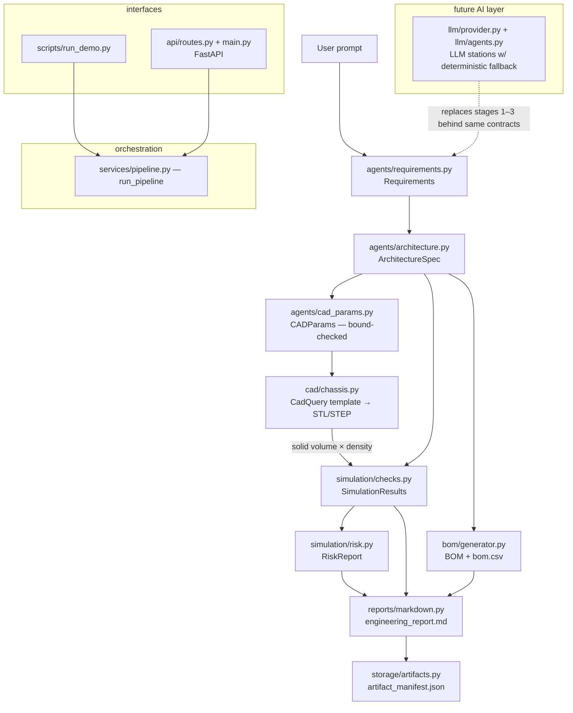

# Architecture

## System diagram

## Modules

| Module | Job | Depends on |
|---|---|---|
| `app/schemas/` | All data contracts (Pydantic). The constitution of the repo. | nothing |
| `app/agents/` | Deterministic pipeline stations (requirements, architecture, cad params) | schemas |
| `app/cad/` | CadQuery template `mobile_robot_base_v1` + placeholder STL fallback | schemas |
| `app/simulation/` | Engineering checks + rule-based risk report | schemas |
| `app/bom/` | Curated BOM generation + CSV writer | schemas |
| `app/reports/` | Markdown report renderer | schemas |
| `app/storage/` | Artifact store (local FS now; swap point for S3/Supabase later) | schemas |
| `app/services/` | `run_pipeline()` — the only place that knows the stage order | everything above |
| `app/api/` + `main.py` | FastAPI wrapper around the pipeline | services |
| `app/llm/` | Provider-agnostic LLM client + LLM stations with fallback | schemas, config |
| `app/config.py` | Env-driven settings (see `env-space`) | nothing |

## Dependency rules (enforced by review, keep them true)

1. `schemas` imports nothing from the app. Everyone imports schemas.
2. Stations never import each other — only `services/pipeline.py` composes them.
3. Only `storage/` touches the filesystem layout; only `config.py` reads env.
4. `llm/` may import deterministic agents (for fallback); never the reverse.

Rule 2 is what makes stations independently replaceable — by better code or
by AI agents.
